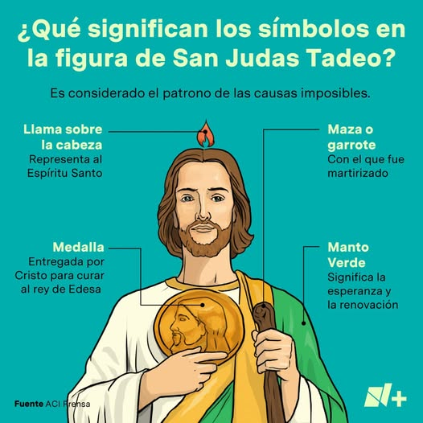

- Formát: spoločné zamyslenie sa 
- Workshop, nie prednáška
<!-- end_slide -->

# Plán
- Predstavenie
- Predstavenie PCA
- AI ako psycholog? Zamyslenie sa
    - Nezbytné PCA podmienky
        - empatia
        - kongruencia
        - bezpodmienečné prijatie
    - Ľudskosť
    - Vzťah
    - Iné aspekty
- Summary
- Diskusia
<!-- end_slide -->

# O sebe
- ITčkár od 2002
<!-- pause -->
- IT ako lepší svet?
<!-- pause -->
- Nefungujúce vzťahy ma priviedli k PCA
    - Najlepší zážitok dovtedy čo som mal
        - To musím vedieť!
<!-- end_slide -->

# Person Centered Approach
<!-- pause -->
- Carl R. Rogers
<!-- pause -->
- Spadá pod humanistickú psychológiu
<!-- pause -->
- Po nemecky tiež „Gesprächstherapie“
<!-- pause -->
- Metóda:
    - empatia
    - kongruencia
    - bezpodmienečné prijatie
<!-- end_slide -->

# AI ako druhý človek?
<!-- pause -->
- empatia?
<!-- pause -->
- kongruencia (autenticita)?
<!-- pause -->
- bezpodmienečné prijatie?
<!-- end_slide -->
    
# Ľudskosť?

<!-- pause -->
## _I'm perfectly imperfect_

<!-- pause -->
- byť skutočný vs. zdanie dokonalosti
    - AI halucinácie
<!-- pause -->
- Zážitok
    - MX nemocnica a San Judas Tadeo
    - Vaše?

<!-- end_slide -->

# Vzťah?
<!-- pause -->
- je perfekcia schopná vzťahu?
<!-- pause -->
- ľudia sa vzťahujú opravdovosti, úprimnosti, nedokonalosti
<!-- pause -->
- PCA: vzťah lieči
<!-- pause -->

# Iné aspekty
<!-- pause -->
- Hranice?
<!-- pause -->
- Cieľ?
<!-- pause -->
- Dôvera?
<!-- pause -->
- Zodpovednosť?
<!-- pause -->
- Ťažkosti -> Skúsenosti -> Rast?
<!-- pause -->
- Hĺbka
    - AI **nemá autenticitu, vnútorný zážitok**
    - AI nejde do hĺbky bytia, zostáva na povrchu (analýza)
    - dojem, **okúzlenie vs. transformácia**
<!-- end_slide -->

# AI ako terapeut?
- Skvelý junior developer
<!-- pause -->
- V psychológii dobrý pre KBT či analytické vetvy
<!-- pause -->
- Nástroj, dobrý sluha, zlý pán
    - Pozor na use-case pri povídání
<!-- end_slide -->

# Diskusia 
<!-- end_slide -->

# Ďakujem za pozornosť

* https://martinuzak.com
