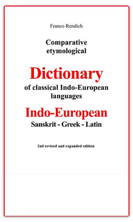

# Quiz 1
- Čo to je _náhoda_?
<!-- pause -->
- Čo sú indikácie toho, že niečo nie je náhoda?
<!-- pause -->
- Vznikol jazyk náhodou?

<!-- end_slide -->
# Prečo sa týmto zapodievať?
- Jazyk je programovacia reč ľudskej mysle
<!-- pause -->
- Objavovať a učiť sa
    - metafora
    - fallback: intelektuálne sudoku
<!-- pause -->
- Pôvod
<!-- pause -->
- Zmysel
<!-- end_slide -->
    
# Začíname
> Samsara is only a superimposition, an appearance. Without this realization there is nothing like **svabodha** in anybody’s life at any time.

<!-- pause -->
* svabodha -> svoboda -> sloboda
<!-- pause -->
* Swami TV: seba-poznanie
<!-- pause -->
* *Stručný etymologický slovník slovenčiny* od Libora Králika:

> **sloboda** (od 15\. stor.) Pôvodne asi _svoboda_ (tak v iných sl. jazykoch: čes. _svoboda_, rus. _svobóda_ (_свобода_) а і.), vznik formy _sloboda_ možno vysvetliť disimiláciou perných spoluhlások v-b- \> l-b-. Východiskom výrazu je psl. \*svoboda, nejasného pôvodu – môže byť odvodené (k prípone porov. _jahoda_ ap.) od koreňa \*_svob_- (porov. csl. _svob-bstvo_ (**CBO-БЬСТВО**), 'osoba', resp. aj lot. at-svab-inât 'oslobodiť'), od ide. \*seue-, \*sue- (svoj), čo predpokladá pôvodný význam typu 'patriaci k svojim, k vlastnému rodu' \> 'slobodný'; iný výklad tu vychádza z ide. \*_suo-pot-_ (s predpokladaným variantným \*_-bod-_), 'kto je svojím pánom', od ide. \*_seue-_, \*_sue-_ (svoj) a \*_pot-_, 'pán' (ďalej pozri _hospodár_). K **slobodomurár** pozri _múr_.


<!-- end_slide -->
    
# Etymológia
* Akademicka. Hľadá rozdiely.
* Ta druhá. Hľadá prienik. Reverzné inžinierstvo.
    * Franco Rendich: Comparative etymological Dictionary of classical Indo-European languages: Indo-European - Sanskrit - Greek - Latin


    
<!-- end_slide -->
# Systém 
## Spoluhlásky popisujú javy (ukážka)

**d** - svetlo  
**m** - limit, hranica, obmedzenie  
**r** - stúpať, dosiahnuť  
**t** - pohyb medzi dvoma bodmi  
**s, š** - blízkosť, spojenie, podobnosť, zjednotenie  

## Samohlásky modulujú (ukážka)

**a-** začiatok akcie  
**-a** - koniec deja  
**i** - stály pohyb, ísť, stúpať  
**u** - stabilita, sila, trvalosť, stáza, intenzita  

<!-- end_slide -->

Ukažka slovník Rendicha

<!-- end_slide -->

# RD - príchod svetla
* **n** - vody, ničota
* **d** - svetlo
* **r** - príchod

<!-- pause -->

Aplikákcia v IE rečiach:
<!-- pause -->
* EN: oRDer, 
<!-- pause -->
* ES: oRDen,
<!-- pause -->
* DE: ORDnung,
<!-- pause -->
* SK: RáD, poRiaDok, RaDosť.

<!-- pause -->

Aký je rozdiel medzi chaosom a kozmosom?
<!-- pause -->

- Vesmír ako _vše-smer_ - to, čo rastie do všetkých smerov.
<!-- pause -->
- Rovnaký význam ako IE koreň _kha_ (_to čo sa rozpína krivočiaro_)
<!-- pause -->
- _Kha_ je koreň pre _chaos_ aj _kozmos_. Kozmos je usporiadaný. Preto krásny a preto _kozmetika_.

<!-- end_slide -->

# MDR - nepodmienené potešenie
* **d** - svetlo
* **r** - príchod
* **m** - limit

```
d -> ad -> mad -> mud -> mudra
```

<!-- pause -->
_Múdrosť_ ako opojenie stvorením, _mudra_ ako symbol toho.
<!-- end_slide -->

# SMR - koniec materiálnej formy

* **s** - blízkosť
* **m** - limit
* **r** - príchod

<!-- pause -->
Aplikácia:
- SA: Marut, smrti
- LAT: memoria, Mars, Martin, Marek
- EN: mortality, murder
- DE: Mord
- SK: smrť, morena, mrcina, mrieť, mŕtvy, mor, mordovať

<!-- end_slide -->

# Pozor
- Umenie, nie mechanicky systém
- Aplikovať všetko, čo vieme a výsledok musí davať zmysel 
- Nie vždy bude fungovať
<!-- end_slide -->

# Zaujímavé slova
- Dunaj, Don
- Rín, Rhóna
- Tatry
- Killimanjaro
- Ljubljana
- Váh
- Himaláje
- sivá
- šíla
- sa:kAla -> kal, kálať, kalendár
- sa:kAla = en:black, en:time
- sa:iSu ~ šíp
- sa:dvAra -> dvere
- sa:bheda -> beda
- sa:lup -> lúpiť, lup
- sa:yama -> jama
- sa:shuci -> súci
- sa:rasa -> rosa
- sa:pas -> pes
- sa:lakSmI -> lakomý
- sa:lubh -> lúbiť
- sa:vAta -> vietor
- sa:krp -> sa:kRpA = en:favour, en:grace
- sa:kRpA -> krpec, krpatý
- sa:trasyati -> triasť sa
- sa:budhyati -> zubodiť
- sa:cur = en:to steal
- sa:kUpah = en:well
- sa:kUpah ~ kúpať sa

<!-- end_slide -->
# Feedback

<!-- end_slide -->
# Ďakujem za pozornosť

* https://github.com/uzak/etymolog
* https://uzak.github.io/etymolog/
* https://martinuzak.com


<!--
Kal, kalendar, kalat, kali
Ljubljana, Tatry, Dunaj, Vah, Kilimanjaro
Modry, Cerveny, Rudy, Biely, Sivy

s
m
r
d
-->
